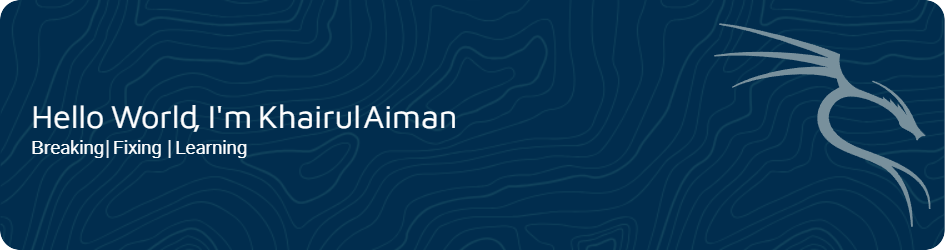

## Hello World! I'm Khairul Aiman 👋

<picture>
  <source media="(prefers-color-scheme: dark)" srcset="https://raw.githubusercontent.com/k41r0s3/k41r0s3/output/pacman-contribution-graph-dark.svg">
  <source media="(prefers-color-scheme: light)" srcset="https://raw.githubusercontent.com/k41r0s3/k41r0s3/output/pacman-contribution-graph.svg">
  
</picture>

##### About me
A cybersecurity enthusiast currently interning with a Network and Server team, gaining hands-on IT infrastructure experience while sharpening my offensive security skills. Passionate about penetration testing, network security, and cloud security, I actively upskill through Hack The Box and online courses to build a strong foundation for my future as an offensive security professional.

##### Programming Language

    

##### Office
   

##### Operating System
    

##### Security Platform
   

##### Network Monitoring 
 

##### Server Management

##### Disaster Recovery, Backup Replication and Data Protection
   

##### Security Tools
   

##### Virtualization

##### IDE

##### Framework and Library
  

##### Database
 

##### Artifical Intelligence

###
##### Connect with me
 

###

##### Certifications

###

###